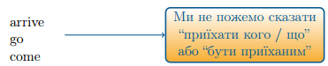
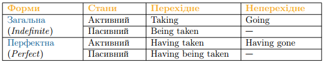

# Форми герундiя

Як й інфінітив, герундій має свої власні форми, але вже не 4, а лише 2: загальна та пефектна, обидві можуть існувати як в активному так і пасивному стані.

Перш ніж звернутися до форм герундія, давайте ще раз згадаємо що таке перехідні та неперехідні дієслова.

Отже, пригадаємо, що дієслова також поділяютья не <b>перехідні</b> та <b>неперехідні</b>. Від <b>перехідних</b> дієслів ми можемо поставити пряме питання (кого/що?) до залежного слова, і дія дієслова переходить на це залежне слова, а <b>неперехідні</b> дієслова не мають залежних слів, і дія від них не переходить на інші предмети або особи.

<ol>
<li>Перехідні <i>Transitive verbs</i></li>
<ul>
<li>Коли від дієслова можна поставити запитання до залежного від нього іменника або займенника</li>
<li>Перехідні дієслова мають і активний і пасивний стан</li>
<li>Verb + object (кого/що?)</li>

<i>take (what?) $$\rightarrow$$ take a pencil</i>

<i>drink (what?) $$\rightarrow$$ drink water</i>

</ul>
<li>Неперехідні <i>Intransitive verbs</i></li>
<ul>
<li>Означають стан або дію, які не переходять на інший предмет.</li>
<li>Неперехідні дієслова мають тільки активний стан.</li>
</ul>
</ol>

А тепер давайте розглянемо вже безпосередньо форми герундія та як вони будуються.

<ol>
<li><b>Загальна форма (Indefinite form)</b></li>

Активний стан (Active voice)

Пасивний стан (Passive voice)

<li><b>Перфектна форма (Perfect form)</b></li>

Активний стан (Active voice)

Пасивний стан (Passive voice)

</ol>

<iframe align="center" width="560" height="315" src="https://www.youtube.com/embed/xfhlgCqsL8U" frameborder="0" allowfullscreen></iframe>

<quiz correctLabel="correct" incorrectLabel="incorrect" checkLabel="check">
    <question text="">
        
Герундій може бути у таких формах:

        <answer>Загальній і тривалій перфектній </answer>
        <answer correct>Загальній і перфектній</answer>
        <answer>Загальній і тривалій</answer>
        <answer>Тривальній і перфектній</answer>
    </question>
</quiz>

#Будова герундія

Давайте тепер розглянемо, яким чином ми будуємо форми герундія. Розглядаючи цю тему варто також знову згадати про перехідні та неперхідні дієслова.

###Перехідні дієслова

Загальна форма
<table>
<tr>
<td><b>Активний стан</b></td>
<td>taking</td>
</tr>
</table>

4-та форма дієслова, з закінченням -ing.

<table>
<tr>
<td><b>Пасивний стан</b></td>
<td>being taken</td>
</tr>
</table>

допоміжне дієслово to be в 4-й формі, з закінченням -ing, основне дієслово в 3-й формі.

Перфектна форма
<table>
<tr>
<td><b>Активний стан</b></td>
<td>having taken</td>
</tr>
</table>

допоміжне дієслово to have  в 4-й формі, з  закінченням -ing, основне дієслово в 3-й формі.

<table>
<tr>
<td><b>Пасивний стан</b></td>
<td>having being taken</td>
</tr>
</table>

допоміжне дієслово to have  в 4-й формі, з закінченням -ing, допоміжне дієслово to be в 4-й формі, з закінченням -ing, основне дієслово в 3-й формі.

###Неперехідні дієслова

Загальна форма
<table>
<tr>
<td><b>Активний стан</b></td>
<td>going</td>
</tr>
</table>

4-та форма дієслова, з закінченням -ing.

Перфектна форма
<table>
<tr>
<td><b>Активний стан</b></td>
<td>having gone</td>
</tr>
</table>

допоміжне дієслово to have  в 4-й формі, з  закінченням -ing, основне дієслово в 3-й формі.

Знову ж таки варто зазначити, що форми герундія вживаються не просто так, а з метою виразити думку автора та повідомити про дії відносно до певного часу, якщо він використовує герундій у своємо мовленні.

##Вживання та значення форм герундія

<ol>
<li>Загальна форма вживається для вираження одночасної дії щодо дії, вираженої дієсловом–присудком.</li>

<b>I enjoy learning English</b>. (Вивчення англійської мови приносить мені задоволення. (Дослівно: Я насолоджуюся вивченням англійської мови. Я зараз насолоджуюсь тим, що я вивчаю англійську мову.)

<li>Також вживається для вираження майбутньої дії по відношенню до дієслова–присудка.</li>

<b>I am risking loosing the opportunity</b>. (Я ризикую втратити цю можливість. (Я зараз ризикую тим, що втрачу цю можливість, але не зараз, а у майбутньому, це ще не сталося, я ще не втратив можливість.)

<li>А також може вживатися безвідносно до певного часу.</li>

<b>Working hard is very important to earn a lot of money</b>. (Старанно працювати – дуже важливо, для того щоб заробляти багато грошей. (Герундій не має жодної часової приналежності, в цьому реченні ми не говоримо про час і не знаемо, коли відбувається дія.) 

</ol>

<quiz correctLabel="correct" incorrectLabel="incorrect" checkLabel="check">
    <question text="">
        
Загальна форма вживається для вираження

        <answer>Одночасної або майбутньої дії по відношенню до дієслов-присудка</answer>
        <answer>Минулої дії по відношенню до дієслова-присудка</answer>
        <answer>Майбутньої дії по відношенню до дієслова-присудка</answer>
        <answer correct>Одночасної або майбутньої дії по відношенню до дієслова-присудка або вживається безвідносно до певного часу</answer>
    </question>
</quiz>