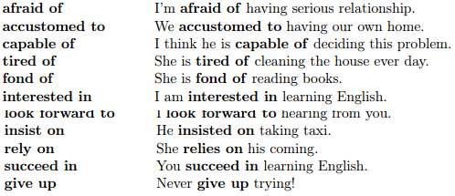
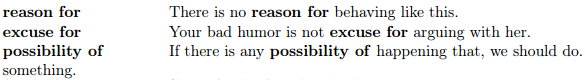

# Вживання герундiя

Як вже було вище зазначено, як і з інфінітивом, існує певний перелік слів та словосполучень після яких вживається герундій.

Нижче наведено перелік дієслів, та дієслів, іменників і прикметників з прийменниками, а також інші випадки, після яких вживається герундій.

##Герундій ЗАВЖДИ вживається після наступних дієслів

<quiz correctLabel="correct" incorrectLabel="incorrect" checkLabel="check">
    <question text="">
        
Після дієслів wish, want, decide ми вживаємо

        <answer>Герундій</answer>
        <answer>Дієприкметник</answer>
        <answer correct>Інфінітив</answer>
    </question>
    <question text="">
        
Після дієслів suggest, finish, resist ми вживаємо

        <answer correct>Герундій</answer>
        <answer>Дієприкметник</answer>
        <answer>Інфінітив</answer>
    </question>
</quiz>

##Дієслова з прийменниками після яких вживається герундій

##Прикметники з прийменниками, після яких вживається герундій

##Іменники з прийменниками, після яких вживається герундій

##GO з герундієм

Коли ми хочемо зазначити, що збираємося займатися якимось видом спорту або іншою діяльністю і використовуємо для цього дієслово to go, то після нього вживаємо герундій.

<ul>
<li><b>go boating</b></li>
<li><b>go bowling</b></li>
<li><b>go dancing</b></li>
<li><b>go fishing</b></li>
<li><b>go hiking</b></li>
<li><b>go running</b></li>
<li><b>go sailing</b></li>
<li><b>go swimming</b></li>
</ul>

<quiz correctLabel="correct" incorrectLabel="incorrect" checkLabel="check">
    <question text="">
        
Після дієслова GO в значенні спорту або якоїсь діяльності вживається

        <answer>Герундій</answer>
        <answer correct>Дієприкметник</answer>
        <answer>Інфінітив</answer>
    </question>
</quiz>

##Герундій після BY

Ми вживаємо герундій після by, коли даємо відповідь на запитання Як? Яким способом? (How? –By doing something)

<ul>
<li><b>by taking</b></li>
<li><b>by listening</b></li>
<li><b>by watching</b></li>
<li><b>by cleaning</b></li>
</ul>