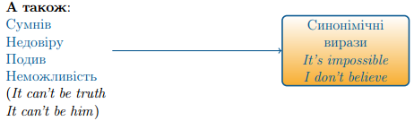

# Can (be able to)

<ul>
<li>Модальне дієслово <b><i>can</i></b> може бути замінене на <b><i>be able to</i></b></li>
<li>Вони мають однакове значення</li>
<li><b><i>Be able to</i></b> вживається у <b><i>Future</i></b></li>
</ul>

Can <b>виражає</b>:

<ol>
<li>Фiзичну або ментальну можливiсть (здiбнiсть)  (Physical or mental ability)</li>

<i>I can speak English.</i>

<i>I can dance well.</i>

<li>Можливість (Possibility)</li>

<i>It can happen tomorrow.</i>

<li>Дозвіл (Permission)</li>

<i>Can I come in?</i>

<li>Прохання (Request or asking)</li>

<i>Can you help me?</i>

<li>Заборону (в запереченнях) (Prohibition)</li>

<i>You can't smoke here.</i>

</ol>

З таким змістом вживається лише в <b><i>питальних</i></b> та <b><i>заперечних</i></b> реченнях.

<quiz correctLabel="correct" incorrectLabel="incorrect" checkLabel="check">
 <question multiple>
 
Be able to вживається (мое бути декілька варіантів відповіді)

 <answer correct>Замість can у майбутньому</answer>
 <answer correct>Має таке ж саме значення, що й can</answer>
 <answer>Не може замінити can</answer>
 <answer>Замість can у минулому</answer>
 </question>
 <question multiple>
 
Які спільні значення виражають Can та Could (мое бути декілька варіантів відповіді)

 <answer>Фізична можливість</answer>
 <answer>Ментальна та фізична можливість</answer>
 <answer>Подив, недовіра</answer>
 <answer correct>Дозвіл</answer>
 <answer correct>Можливість</answer>
 <answer correct>Прохання</answer>
 <answer>Пропозиція</answer>
 <answer correct>Заборона в запереченнях</answer>
 </question>
 </quiz>