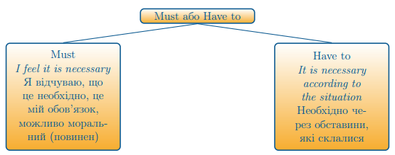

# Have to

Have to <b>виражає</b>:

<ol>
<li>Обов’язок (Obligation)</li>

<i>I have to do this. Я повинен (маю) це зробити.</i>

Мається на увазі, що так склалися обставини, що я повинен це зробити, а не це мій обов’язок.

<li>Необхідність (Necessity)</li>

<i>I have to stay longer because she needs my help. Я повинен ще залишитись, бо вона потребує моєї допомоги.</i>

Тобто, існує така необхідність, щоб я залишився, обставини скалалися таким чином, що необхідна моя присутність.

<li>-	В запереченнях в значенні «не потрібно» (no need)</li>

<i>You don't have to wake up so early, tomorrow is Saturday. Тобі не потрібно прокидатися так рано, завтра субота.</i>

</ol>

<quiz correctLabel="correct" incorrectLabel="incorrect" checkLabel="check">
 <question multiple>
 
Різниця між must та have to в тому, що

 <answer correct>Must виражає необхідність в значенні «повинен», а have to виражає необхідність видповідно до ситуації</answer>
 <answer correct>Have to та must виражають необхідність згідно з певною ситуацією, різниці немає</answer>
 <answer>Have to виражає необхідність, а must обов’язок</answer>
 <answer>Have to виражає суворий наказ, а мust використовується в запереченнях в значенні «не потрібно»</answer>
 </question>
</quiz>