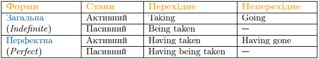

# Participle I

Participle I — це Present Participle. Present Participle не має певного часового значення, не зважаючи на те, що називається дієприкметником теперішнього часу, і виражає різні часові відношення залежно від контексту і значення дієслова.

## Будова Participle I

Варто зазначити, що форми Participle I повністю збігаються з формами герундія і будуються так само. Але різниця між Р І та герундієм полягає у значенні та вживанні.

Перехідні дієслова

Звичайна форма
<table>
<tr>
<td><b>Активний стан</b></td>
<td>Taking</td>
<td>4 форма дієслова, з закінченням -ing</td>
</tr>
<tr>
<td><b>Пасивний стан</b></td>
<td>Being taken</td>
<td>допоміжне дієслово to be в 4-формі, з закінченням -ing, основне дієслово в 3-й формі</td>
</tr>
</table>

Перфектна форма
<table>
<tr>
<td><b>Активний стан</b></td>
<td>Having taken</td>
<td>допоміжне дієслово to have в 4-й формі, з закінченням -ing, основне дієслово в 3-й формі</td>
</tr>
<tr>
<td><b>Пасивний стан</b></td>
<td>Having been taken</td>
<td>допоміжне дієслово to have в 4-й формі, з закінченням -ing, допоміжне дієслово to be в 3-й формі, з закінченням -ing, основне дієслово в 3-й формі</td>
</tr>
</table>

Неперехідні дієслова

Звичайна форма
<table>
<tr>
<td><b>Активний стан</b></td>
<td>Going</td>
<td>4-та форма дієслова, з закінченням -ing</td>
</tr>
</table>

Звичайна форма
<table>
<tr>
<td><b>Активний стан</b></td>
<td>Having gone</td>
<td>допоміжне дієслово to have в 4-й формі, з закінченням -ing, основне дієслово в 3-й формі</td>
</tr>
</table>

<iframe align="center" width="560" height="315" src="https://www.youtube.com/embed/YOuK2Uip8O4" frameborder="0" allowfullscreen></iframe>

<quiz correctLabel="correct" incorrectLabel="incorrect" checkLabel="check">
    <question text="">
        
Participle I — це

        <answer correct>Present Participle, активний дієприкметник</answer>
        <answer>Past participle, пасивний дієприкметник</answer>
        <answer>Present Participle, пасивний дієприкметник</answer>
        <answer>Past Participle, активний дієприкметник</answer>
    </question>
    <question text="">
        
Які бувають форми Present Participle?

        <answer>Загальна та тривала</answer>
        <answer>Загальна, тривала та перфектна тривала</answer>
        <answer correct>Загальна та перфектна</answer>
        <answer>Тривала та перфектна</answer>
    </question>
    <question text="">
        
Неперехідні дієслова не мають

        <answer>Звичайної форми</answer>
        <answer>Активного стану</answer>
        <answer correct>Пасивного стану</answer>
        <answer>Перфектної форми</answer>
    </question>
</quiz>

## Функції в реченні

Participle I як дієприкметик, виконує не багато функцій упеченні, серед них можна виділити:

<ul>
<li>Означення (Attribute)</li>

Тільки звичайна форма, не перфектна.

I saw a kissing couple. -What couple? -Kissing

Я бачив парочку, що цілується. -Яку парочку? -Що цілується

<li>Обставина (Adverbial modifier)</li>

Виступає у ролі обставини після сполучників when, while.

I always smile while singing. -Smile when? -While singing.

Я завжди посміхаюся, співаючи. Коли поспімахаюся? -В той час як співаю.

</ul>

Важливо розрізняти герундій та Participle I в даному контексті. Якщо наша «-ing»  форма стоїть після сполучника while або when, то це Participle I.

Небагато чого по суті можна сказати про Participle I, але з ним виникає досить багато плутанини через велику кількість -ing форм в англійській мові: прикметники, форми дієслів часів continuous, герундій, тривала форма інфінітиву, а тепер ще і Participle I — дієприкметник теперішнього часу.

По-перше потрібно відштовхуватися від функції його у реченні, а як ми вже зазначили, частіше за все це означення або обставина. В англійській мові Participle варто використовувати саме як дієприкметник чи дієприслівник. Тобто, якшо ви в українській мові в реченні використовуєте дієприкметник чи дієприслівник: або ж конструкцію «що робить щось» (як  було в прикладі, що наведено вище: парочка, що цілується), то скоріше за все в цьому ж реченні англійською ви також можете використати дієприкметник.

