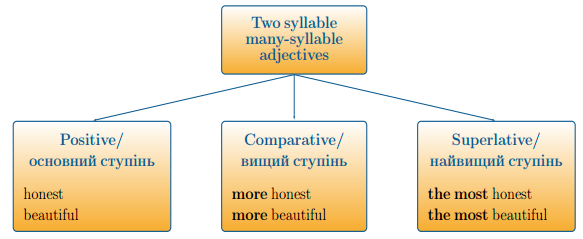

#Багатоскладовi прикметники

Коли ми утворюємо ступені порівняння двоскладових прикметників, що не закінчуються на <b>–y, -e, -ow, -er</b>, або прикметників, що мають більше двох складів:

<ol>
<li>у вищому ступені ми додаємо до самого прикметника слово «more», при чому сам прикметник залишається не змінним.</li>
<li>у найвищому ступені ми додаємо означений артикль the та слово most (виходить the most), при чому сам прикметник залишається не змінним.</li>
</ol>

#Неправильні прикметники

Існує декілька прикметників, які змінюються за власною моделлю під час утворення ступенів порівняння, однак завжди у найвищому ступені вживається означений артикль.

<ol>
<li>Good – better – the best</li>
<li>Bad - worse – the worst</li>
<li>Far – farther – the farthest</li>
<li>Far – further – the furthest</li>
<li>Many – more – the most</li>
<li>Much – more – the most</li>
<li>Little – less – the least</li>
</ol>