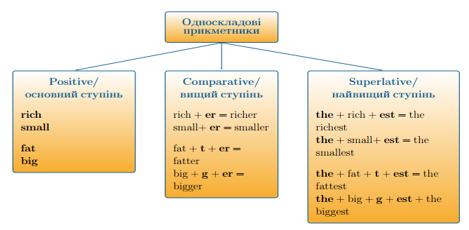

#Односкладовi прикметники

Коли ми утворюємо ступені порівняння односкладових прикметників:

<ol>
<li>У вищому ступені ми додаємо закінчення –er.</li>
<li>У найвищому додаємо закінчення –est та означений артикль перед самим прикметником.</li>
</ol>

Однак, якщо односкладовий іменник закінчується на одну приголосну літеру, то вона подвоюється під час утворення вищого та найвищого ступенів порівняння.

