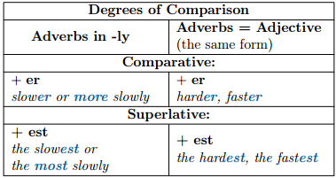
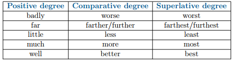

# Cтупенi порiвняння прислiвникiв

Як і у прикметників, у прислівників також існують ступені порівняння, причому прислівники утворють ступені порівняння майже так само як і прикметники і навіть існують “неправильні” прислівники.

<ul>
<li><b>Прислівники на –ly:</b></li>

Утворення ступенів порівняння в прислівниках дуже схоже на утворення ступенів порівняння у прикметників. Якщо у нас є односкладовий аьо двоскладовий прислівник, що закінчується на -ly, ми прибираємо закінчення -ly, а замість нього додаємо -er у вищому ступені та -est у найвищому, не забуваючи про означений артикль. Або ми можемо залишати прислівник без змін, а просто додати more  або the most у вищому та найвищому ступенях порівняння відповідно. Остання модель утворення (more/the most) використовується і для багатоскладових прислівників на -ly.

<li><b>Прислівники – прикметники:</b></li>

Ступені порівняння у прислівниках — прикметниках утворюються так само, як і у прикметниках. Ми додаємо закінчення –er для вищого ступеня порівняння та –est у найвищому ступені (+ означений артикль the).

</ul>

<ul>
<li>Неправильні прислівники (Irregular adverbs)</li>

Як і у прикметників, у прислівників також існують “неправильні прислівники”, які мають власну модулю утворення ступенів порівняння. Ніще у таблиці можна ознайомитися з цими прислівниками.

</ul>

Запам'ятайте

Well може бути як прислівником так і прикметником.

<ol>
<li>well – прислівник (в значенні “good”):  <i>She plays piano well. – Вона добре грає на фортепіано.</i></li>
<li>well – прикметник ( в занченні “in good health”):  <i>How are you today? I’m well. —Як ти себе почуваєш сьогодні? – Добре.</i></li>
</ol>

<iframe align="center" width="560" height="315" src="https://www.youtube.com/embed/CuCcPOK25yo" frameborder="0" allowfullscreen></iframe>

<quiz correctLabel="correct" incorrectLabel="incorrect" checkLabel="check">
    <question text="">
        
Як утворюються ступені порівняння прислівників?

        <answer>+est; +er</answer>
        <answer>+er; the... +est</answer>
        <answer correct>+er (more); the... +est (the most)</answer>
        <answer>ly = i + es; ly = i + ed</answer>
    </question>
</quiz>
