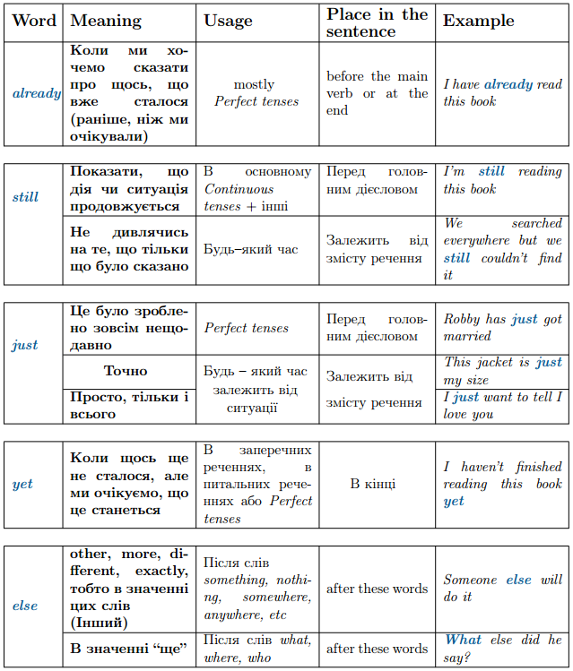

# Практичне вживання та мiсце в реченнi прислiвникiв

<!---->

<h3>already/still/just/yet/else</h3>

<table>
    <body>
    <tr>
            <td width="30%" align="center" valign="top">
                Meaning
            </td>
            <td width="20%" align="center" valign="top">
                Usage 
            </td>  
            <td width="25%" align="center" valign="top">
                Place in the sentence
            </td>
            <td width="25%" align="center" valign="top">
                Example
            </td>       
        </tr>
        <tr>
            <td colspan="4" align="center" valign="top">
                <b>Already</b>
            </td>                       
        </tr>
        <tr>
            <td width="30%" align="center" valign="top">
               <b> Коли ми хочемо сказати про щось, що вже сталося (ранiше, нiж ми очiкували)</b>
            </td>
            <td width="20%" align="center" valign="top">
                В основному разом з часами групи <i>Perfect</i>
            </td>  
            <td width="25%" align="center" valign="top">
                Перед головним дієсловом в реченні
            </td>
            <td width="25%" align="center" valign="top">
                I have already read this book.
            </td>       
        </tr>
        <tr>
            <td colspan="4" align="center" valign="top">
                <b>Still</b>
            </td>                       
        </tr>
        <tr>
            <td width="30%" align="center" valign="top">
                <b>Показати, що дiя чи ситуацiя продовжується</b>
            </td>
            <td width="20%" align="center" valign="top">
                Переважно з часами групи <i>Continuous</i> та інші
            </td>  
            <td width="25%" align="center" valign="top">
                Перед головним дiєсловом
            </td>
            <td width="25%" align="center" valign="top">
               I’m still reading this book.
            </td>       
        </tr>
        <tr>
            <td width="30%" align="center" valign="top">
                <b>Не дивлячись на те, що тiльки що було сказано</b>
            </td>
            <td width="20%" align="center" valign="top">
                Будь-який час
            </td>  
            <td width="25%" align="center" valign="top">
                Залежить вiд змiсту речення
            </td>
            <td width="25%" align="center" valign="top">
               We searched everywhere but we still couldn’t find it.
            </td>       
        </tr>

        <tr>
            <td colspan="4" align="center" valign="top">
                <b>Just</b>
            </td>                       
        </tr>
        <tr>
            <td width="30%" align="center" valign="top">
               <b>Це було зроблено зовсiм нещодавно</b>
            </td>
            <td width="20%" align="center" valign="top">
                Часи <i>Perfect</i>
            </td>  
            <td width="25%" align="center" valign="top">
                Перед головним дiєсловом
            </td>
            <td width="25%" align="center" valign="top">
                Robby has just got married.
            </td>       
            </tr>
        <tr>
        <tr>
            <td width="30%" align="center" valign="top">
               <b>Точно </b>
            </td>
            <td width="20%" align="center" valign="top">
                Будь-який час, залежить від ситуації
            </td>  
            <td width="25%" align="center" valign="top">
                Залежить від змісту речення
            </td>
            <td width="25%" align="center" valign="top">
                This jacket is just my size.
            </td>       
            </tr>
        <tr>
        <tr>
            <td width="30%" align="center" valign="top">
               <b>Просто, тiльки i всього</b>
            </td>
            <td width="20%" align="center" valign="top">
                Теж залежить від ситуації
            </td>  
            <td width="25%" align="center" valign="top">
                Теж залежить від речення
            </td>
            <td width="25%" align="center" valign="top">
                I just want to tell I love you. 
            </td>       
            </tr>
        <tr>

        <tr>
            <td colspan="4" align="center" valign="top">
                <b>Yet</b>
            </td>                       
        </tr>
        <tr>
            <td width="30%" align="center" valign="top">
               <b> Коли щось ще не сталося, але ми очiкуємо, що це станеться</b>
            </td>
            <td width="20%" align="center" valign="top">
                В заперечних реченнях, в питальних реченнях або <i>Perfect tenses</i>
            </td>  
            <td width="25%" align="center" valign="top">
                В кiнцi речення
            </td>
            <td width="25%" align="center" valign="top">
                I haven’t finished reading this book yet.
            </td>       
        </tr>

        <tr>
            <td colspan="4" align="center" valign="top">
                <b>Else</b>
            </td>                       
        </tr>
        <tr>
            <td width="30%" align="center" valign="top">
               <b> other, more, different, exactly, тобто в значеннi цих слiв (інший)</b>
            </td>
            <td width="20%" align="center" valign="top">
                З цими словами <i>something, nothing, somewhere, anywhere, etc</i>
            </td>  
            <td width="25%" align="center" valign="top">
                Після наведених слів
            </td>
            <td width="25%" align="center" valign="top">
                Someone else will do it.
            </td>       
        </tr>
        <tr>
            <td width="30%" align="center" valign="top">
               <b> В значеннi "ще"</b>
            </td>
            <td width="20%" align="center" valign="top">
                Пiсля слiв <i>what, where, who</i>
            </td>  
            <td width="25%" align="center" valign="top">
                Після наведених слів
            </td>
            <td width="25%" align="center" valign="top">
                What else did he
say? 
            </td>       
        </tr>
    </body>
</table>