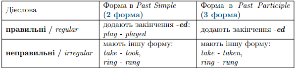

# Часи, з якими вживаються форми основних дiєслiв

<ul>
<li>1 форма (Infinitive) — Present/ Future Simple</li>
<li>2 форма (Past simple) — Past Simple</li>
<li>3 форма (Past participle) — Present/Past/Future Perfect, Passive Construction</li>
<li>4 форма (Present participle) — Present/Past/Future Continuous, Present/Past/Future Perfect Continuous</li>
</ul>

Основні дієслова поділяються на: правильні (<i>regular</i>) та неправильні (<i>irregular</i>)

Утворення форми <b>Past simple</b>:

<ol>
<li>Якщо дієслово закінчується на приголосний, додаємо закінчення <b><i>-ed</i></b>.</li>

<i>work $$\rightarrow$$ work + ed $$\rightarrow$$ <b>worked</b></i>

<li>Якщо дієслово закінчується на голосний, додаємо закінчення <b><i>-d</i></b>.</li>

<i>love $$\rightarrow$$ love + d $$\rightarrow$$ <b>loved</b></i>

<li>Якщо дієслово закінчується на букву <b><i>-y</i></b>, яка стоїть після голосного, додаємо закінчення <b><i>-ed</i></b>.</li>

<i>play $$\rightarrow$$ play + ed $$\rightarrow$$ <b>played</b></i>

<li>Якщо дієслово закінчується на букву <b><i>-y</i></b>, яка стоїть після приголосного, ми змінюємо «<i>y</i>» на «<i>і</i>» та додаємо закінчення <b><i>-ed</i></b>.</li>

<i>study $$\rightarrow$$ stud<s>y</s> + i + ed $$\rightarrow$$ <b>studied</b></i>

<li>Якщо односкладне дієслово закінчується на один голосний і один приголосний або якщо останній склад дієслова під наголосом (prefer, begin, permit, regret), і воно закінчується на один голосний і один приголосний, в 2-й, 3-й і 4-й формах цей приголосний подвоюється:</li>

<i>stop $$\rightarrow$$ stop + p + ed $$\rightarrow$$ <b>stopped</b></i>

<i>$$\qquad$$ $$\rightarrow$$ stop + p + ing $$\rightarrow$$ <b>stopping</b></i>

<i>prefer $$\rightarrow$$ prefer + r + ed $$\rightarrow$$ <b>preferred</b></i>

<i>$$\qquad$$ $$\rightarrow$$ prefer + r + ing $$\rightarrow$$ <b>preferring</b></i>

</ol>

##Неправильні дієслова (Irregular verbs)

Неправильні дієслова мають інші форми в Past Simple і Past Participle.

Вони змінюються за своїми власними моделями. Майже неможливо простежити якусь певну закономірність серед неправильних дієслів. Просто так історично склалося, що певна частина дієслів в англійській мові зміюється не за загальними правилами (не через закінчення -ed), тому її відносять до неправильних дієслів.

##Утворення форми Present participle (VI форми дієслова)

В 4-й формі <b>Present Participle/Participle I</b> ми додаємо закінчення -ing до основної форми дієслова.

<ol>
<li>Якщо дієслово закінчується на <i>-e</i>, ми відкидаємо його і додаємо закінчення <i>-ing</i>.</li>

<i>take $$\rightarrow$$ take + ing $$\rightarrow$$ <b>taking</b></i>

<i>make $$\rightarrow$$ make + ing $$\rightarrow$$ <b>making</b></i>

<li>Якщо дієслово закінчується на буквосполучення <i>-ie</i> (die, lie, tie), змінюємо його на  «y» та додаємо <i>-ing</i>:</li>

<i>die $$\rightarrow$$ d<s>ie</s> + y + ing $$\rightarrow$$ <b>dying</b></i>

<i>lie $$\rightarrow$$ l<s>ie</s> + y + ing $$\rightarrow$$ <b>lying</b></i>

</ol>

