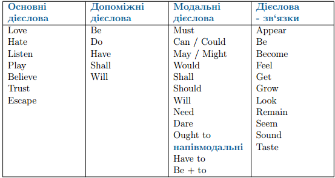

# Дiєслово

Означення

<b>Дієслово</b> — це самостійна частина мови, що означає якусь дію або стан. Дієслово в англійській мові – дуже важлива частина мови. На дієсловах базується утворення часових форм, активного чи пасивного стану а також дієприкметників та дієприслівників. Саме тому надзвичайно важливо дуже добре розібратися в темі «дієслово» та вивчити весь теоретичний матеріал, що стосується даної теми, адже у подальшому вивченні англійської мови дієслово відіграє надзвичайно важливу роль.

Спершу потрібно роглянути, які види та форми дієслів існують дієслова в англійській мові. Розібравшись в цьому аспекті стосовно дієслова, надалі буде набагато легше орієнтуватися в інших темах.

Отже, щодо <b>значення</b> та <b>функції</b> дієслова, його <b>ролі в реченні</b> вони поділяються на:

<ol>
<li><b>Основні дієслова</b>. Це звичайні дієслова, які ми використовуємо в звичайних реченнях.</li>

<i>I like tennis.</i>

<i>Tome offered me a cup of tea.</i>

<i>Mary dances very well.</i>

Тобто звичайні дієслова, що позначають безпосередньо дію, яку виконує предмет або особа.

<li><b>Допоміжні дієслова</b>. Це дієслова, за допомогою яких ми утворюємо питання або заперечення.</li>

<i>I don't have that book.</i>

<i>Do you like tea?</i>

<i>Is this your favourite place?</i>

Тобто ці дієслова допомагають нам утворювати запитальні або заперечні речення в англійській мові.

<b>Дієслова–зв'язки</b>. Є певний перелік цих дієслів, який буде наведено нище, ці дієслова не позначають дію, навіть не зважаючи на їх переклад, а повідомляють про стан предмета або особи. Основна особливість дієслів – зв’язок, що їх легко можна замінити дієсловом to be.

<i>This soup smells tasty. (This soup is tasty.)</i>

<i>You look ill. (You are ill.)</i>

<i>My brother seems happy.(My brother is happy.)</i>

Тобто бачимо, що дієслова зв’язки надають стану певного забарвлення, але їх можна легко замінити на дієслово to be , при чому зміст речення від цього не зміниться.

<li><b>Модальні дієслова</b>. Ці дієслова не вживаються самостійно, а завжди з основними дієсловами, вони допомагають їм виразити додаткові значення.</li>

Більш докладно модальні дієслова ми розглянемо в окремій темі.

</ol>

<b>Ще раз розглянемо види дієслова щодо значення функції та ролі в реченні:</b>

<ul>
<li>Основні дієслова (Main verbs)</li>
<ul>
<li>Означають певну дію.</li>
</ul>
<li>Допоміжні дієслова (Auxiliary verbs)</li>
<ul>
<li>Не означають дію, не перекладаються.</li>
<li>Допомагають будувати заперечно-питальні форми.</li>
</ul>
<li>Дієслова звязки (Linking verbs)</li>
<ul>
<li>Не означають певну дію, сигналізують про стан та є частиною складеного іменного присудка.</li>
<li>Можна замінити дієсловом be.</li>
</ul>
<li>Модальні дієслова (Modal verbs)</li>
<ul>
<li>Допомагають основному дієслову виразити деякі значення.</li>
</ul>
</ul>

##Основні дієслова

Основні дієслова є найважливішими дієсловами, вони найчастіше використовуються в усному та письмовому мовленні, саме тому ми більш детально на них зупинимось.

Основні дієслова мають <b>4 форми</b>:

<ol>
<li>1 форма (Infinitive)</li>
<ul>
<li>Інфінітив або неозначена форма дієслова; перша або базова форма дієслова <i>simple form</i> (без частки to)</li>
<li>Інфінітивом ми називаємо початкову форму дієслова, яку бачимо у словнику.</li>
</ul>
<li>2 форма (Past Simple)</li>
<ul>
<li>Форма Past Simple та Past Participle (2 або 3 форми) для правильних дієслів.</li>
<li>Для нас звично використовувати другу форму дієслова у минулому часі.</li>
</ul>
<li>3 форма (Past Participle)</li>
<ul>
<li>Дієприкметник Participle ІІ або дієприкметник пасивного стану (3 форма для неправильних дієслів)</li>
<li>Для нас звично використовувати третю форму дієслова у часах групи Perfect  або у пасивному стані, але насправді третя форма, на відміну від другої використовується дуже часто, особливо у складних граматичних конструкціях, які ми розглянемо трохи далі. Тож третя форма дієслова є дуже важливою формою.</li>
</ul>
<li>4 форма (Present Participle)</li>
<ul>
<li>Дієприкметник Participle I або дієприкметник активного стану (форма дієслова з закінченням –ing для правильних та неправильних дієслів)</li>
<li>Для нас звично використовувати четверту форму дієслова у часах групи Continuous, але узагалі, будь – яку дієслово, що має закінчення –ing – це четверта форма, а, як ми дізнаємося далі, це не завжди дієслово, що вживається у подовженому часі (continuous).</li>
</ul>
</ol>