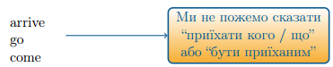
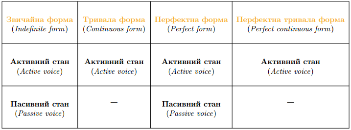
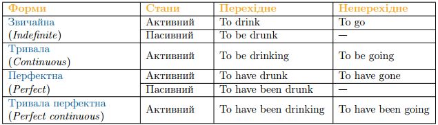

# Форми iнфiнiтиву

Для того щоб далі розглянути інфінітивні форми, тобто в яких формах може вживатися інфінтив, потрібно ще раз звернутися до <b>перехідних</b> та <b>неперехідних</b> дієслів.

Отже, пригадаємо, що дієслова також поділяютья на <b>перехідні</b> та <b>неперехідні</b>. Від <b>перехідних</b> дієслів ми можемо поставити пряме питання (кого/що?) до залежного слова, і дія дієслова переходить на це залежне слова, а <b>неперехідні</b> дієслова не мають залежних слів, і дія від них не переходить на інші предмети або особи.

<ol>
<li>Перехідні <i>Transitive verbs</i></li>
<ul>
<li>Коли від дієслова можна поставити запитання до залежного від нього іменника або займенника</li>
<li>Перехідні дієслова мають і активний і пасивний стан</li>
<li>Verb + object (кого/що?)</li>

<i>take (what?) $$\rightarrow$$ take a pencil</i>

<i>drink (what?) $$\rightarrow$$ drink water</i>

</ul>
<li>Неперехідні <i>Intransitive verbs</i></li>
<ul>
<li>Означають стан або дію, які не переходять на інший предмет.</li>
<li>Неперехідні дієслова мають тільки активний стан.</li>
</ul>
</ol>

<b>Інфінітив має:</b>

<ol>
<li>Звичайну форму <i>Indefinite form</i></li>
<ul>
<li>Активний стан (Active voice)</li>
<li>Пасивний стан (Passive voice)</li>
</ul>
<li>Тривалу форму <i>Continuous form</i></li>
<ul>
<li>Активний стан (Active voice)</li>
</ul>
<li>Перфектну форму <i>Perfect form</i></li>
<ul>
<li>Активний стан (Active voice)</li>
<li>Пасивний стан (Passive voice)</li>
</ul>
<li>Перфектну тривалу форму <i>Perfect continuous form</i></li>
<ul>
<li>Активний стан (Active voice)</li>
</ul>
</ol>

З вище наведених таблиць ми бачимо, що інфінітив має 4 форми: звичайну, тривалу, перфектну та перфектну тривалу. Трохи нище ми детально роглянемо як саме утворюється кожна форма інфінітиву перехідних та неперехідних дієслів, в активному та пасивному станах.

У вас може виникнути абсолютно логічне питання: хіба ж інфінітив не початкова форма дієслова, яку ми бачимо у словнику? А у словнику ми як раз же не бачимо всіх цих громіздких конструкцій з допоміжними дієсловами та -ing закінченнями.

Відповідь на це питання криється як раз у тому, що інфінітив —  це безособова форма дієслова, що має категорію часу. Тобто ми можемо вживати інфінітив відносно до того чи іншого часу.  Далі ми з вами розглянемо як саме і коли ми вживаємо ту чи іншу форму інфінітиву, і відносно до якого часу правильно вживати форми інфінітиву. І, узагалі, англійська мова не є незмінною, і в будь-якому випадку слова можуть міняти свої форми через використання допоміжних дієслів.

А тепер ми з вами на прикладі декількох дієслів розглянемо утворення усіх чотирьох форм інфінітиву.

##Перехідні дієслова

Звичайна форма
<table>
<tr>
<td><b>Активний стан</b></td>
<td>to drink</td>
<td>to take</td>
<td>to make</td>
</tr>
<tr>
<td><b>Пасивний стан</b></td>
<td>to be drunk</td>
<td>to be taken</td>
<td>to be made</td>
</tr>
</table>

допоміжне слово to be та основне дієслово в 3-й формі

Тривала форма
<table>
<tr>
<td><b>Активний стан</b></td>
<td>to be drinking</td>
<td>to be taking</td>
<td>to be making</td>
</tr>
</table>

допоміжне дієслово to be та основне дієслово в 4-й формі (тобто з закінченням -ing

Перфектна форма
<table>
<tr>
<td><b>Активний стан</b></td>
<td>to have drunk</td>
<td>to have taken</td>
<td>to have made</td>
</tr>
</table>

допоміжне дієслово to have та основне дієслово в 3-й формі

<table>
<tr>
<td><b>Пасивний стан</b></td>
<td>to have been drunk</td>
<td>to have been taken</td>
<td>to have been made</td>
</tr>
</table>

допоміжне дієслово  to have, допоміжне дієслово to be в 3-й формі та основне дієслово в 3-й формі

Тривала перфектна форма
<table>
<tr>
<td><b>Активний стан</b></td>
<td>to have been drinking</td>
<td>to have been taking</td>
<td>to have been making</td>
</tr>
</table>

допоміжне дієслово to have, допоміжне дієслово to be в 3-й формі та основне дієслово в 4-й формі (тобто з закінченням -ing)

##Неперехідні дієслова

Звичайна форма
<table>
<tr>
<td><b>Активний стан</b></td>
<td>to go</td>
<td>to come</td>
<td>to live</td>
</tr>
</table>

Тривала форма
<table>
<tr>
<td><b>Активний стан</b></td>
<td>to be going</td>
<td>to be comming</td>
<td>to be living</td>
</tr>
</table>

допоміжне дієслово to be та основне дієслово в 4-й формі (тобто з закінченням -ing

Перфектна форма
<table>
<tr>
<td><b>Активний стан</b></td>
<td>to have gone</td>
<td>to have come</td>
<td>to have lived</td>
</tr>
</table>

допоміжне дієслово to have та основне дієслово в 3-й формі

Тривала перфектна форма
<table>
<tr>
<td><b>Активний стан</b></td>
<td>to have been going</td>
<td>to have been comming</td>
<td>to have been</td>
</tr>
</table>

допоміжне дієслово to have, допоміжне дієслово to be в 3-й формі та основне дієслово в 4-й формі (тобто з закінченням -ing)

##Використання форм інфінітиву 

араз ми побачимо навіщо ми тільки що розглядали так багато форм інфінітивів. А саме для того, щоб ми могли використовувати інфінітив у різних часах, щоб можна було зрозуміти який саме час має на увазі автор висловлювання.  На даному етапі вивчення інфінітиву потрібно зрозуміти, що використання інфінітивів в англійській мові є дуже розповсюдженим явищем, тож форми інфінітиву нам потрібні саме для того, щоб автор висловлювання міг передати саме той час в якому відбувається дія, а читач чи слухач міг це зрозуміти. Хоча справедливо буде зазначити, що в усному мовленні досить рідко можна зустріти складні інфінітивні конструкції, адже носії англійської мови стараються якнайбільше спростити усне мовлення. А от у письмовому мовленні такі конструкції – не рідкість.

<ol>
<li>Indefinite infinitive</li>
<ul>
<li>Загальну інфінітивну форму використовують, коли дія, виражена інфінітивом є одночасною щодо дії, вираженою дієсловом – присудком.</li>

I am glad to do this. (Я радий це робити. (Мається на увазі, що я зараз радий це робити. Дві дії відбуваються одночасно, він радий і він щось робить.)

<li>Або дія, виражена інфінітивом, є майбутньою щодо дії, вираженою дієсловом – присудком.</li>

I want to do this. (Я хочу це зробити. (Мається на увазі, що хоче він зараз, але він цього ще не зробив, а зробить у майбутньому.)

</ul>
<li>Continuous infinitive</li>
<ul>
<li>Тривалу форму інфінітиву використовують, коли дія, виражена   інфінітивом, є одночасною з дією, яка виражена дієсловом - присудком.</li>

I am happy to be doing this. (Я радий, що я роблю це. (Мається на увазі, що він    робить щось протягом якогось часу, його дія тривала.)

</ul>
<li>Perfect infinitive</li>
<ul>
<li>Перфектний інфінітив використовують тоді, коли дія, виражена інфінітивом, передує дії, яка виражена дієсловом присудком.</li>

I am glad to have done this. (Я радий був зробити це. (Мається на увазі, що він зараз радий, а зробив він до цього моменту, у минулому.)

</ul>
<li>Perfect continuous infinitive</li>
<ul>
<li>Тривалу перфектну форму інфінітиву використовують, коли дія, виражена інфінітивом, є тривалою і відбувалася протягом певного часу перед дією, яка виражена дієсловом – присудком.</li>

I am glad to have been dating with you for 5 years. (Я радий, що зустрічався з тобою протягом 5 років. (Мається на увазі, що він зараз радий, а до цього він зустручався з нею, у минулому, протягом якогось тривалого періоду.)

</ul>
</ol>