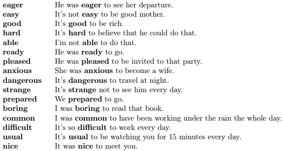

# Вживання iнфiнiтива

В англійській мові існує певний перелік слів після яких вживаються інфінітиви. (Такий самий перелік існує і для герундія, тож важливо добре запам’ятати, після яких саме слів вживається інфінітив, а після яких герундій, щоб не плутатись). Даний перелік потрібно просто добре запам’ятати.

##Iнфiнiтив з дiєсловами

##Iнфiнiтив з прикметниками

